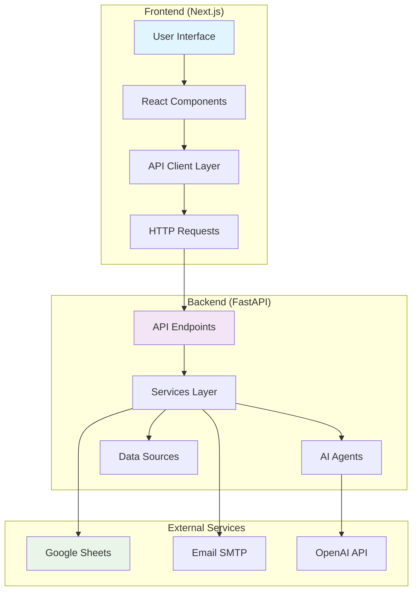

# 🏗️ Solar Installer AI - Complete Architecture Blueprint

> **A comprehensive guide to understanding the complete system architecture, data flow, and component interactions**

## 📋 Table of Contents

1. [System Overview](#-system-overview)
2. [Project Structure](#-project-structure)
3. [Frontend Architecture](#-frontend-architecture)
4. [Backend Architecture](#-backend-architecture)
5. [Data Flow & API Communication](#-data-flow--api-communication)
6. [External Integrations](#-external-integrations)
7. [Authentication & Security](#-authentication--security)
8. [Deployment Architecture](#-deployment-architecture)

---

## 🌟 System Overview

Solar Installer AI is a modern, full-stack application designed for solar installation companies to manage inventory, procurement, and forecasting. The system follows a **microservices-inspired architecture** with clear separation of concerns.

### 🎯 Core Principles
- **Separation of Concerns**: Frontend, Backend, and Shared resources are clearly separated
- **API-First Design**: All communication happens through well-defined REST APIs
- **Real-time Data**: Live Google Sheets integration for real-time inventory tracking
- **Scalable Architecture**: Modular design allows for easy scaling and maintenance
- **Type Safety**: TypeScript throughout the stack ensures type safety

---

## 📁 Project Structure

```
solar_installer_ai/
├── 🌐 frontend/                    # Next.js React Application
│   ├── src/
│   │   ├── app/                    # Next.js App Router Pages
│   │   │   ├── dashboard/          # Dashboard page & components
│   │   │   ├── inventory/          # Inventory management page
│   │   │   ├── procurement/        # Procurement page
│   │   │   ├── forecast/           # Forecasting page
│   │   │   ├── analytics/          # Analytics & charts page
│   │   │   ├── sheets/             # Google Sheets integration page
│   │   │   ├── login/              # Authentication page
│   │   │   └── api/                # Frontend API routes (Next.js API)
│   │   ├── components/             # Reusable React Components
│   │   │   ├── layout/             # Layout components (Header, Sidebar)
│   │   │   ├── charts/             # Chart components (Recharts)
│   │   │   ├── inventory/          # Inventory-specific components
│   │   │   ├── procurement/        # Procurement-specific components
│   │   │   ├── forecast/           # Forecasting components
│   │   │   └── ui/                 # Base UI components (shadcn/ui)
│   │   ├── lib/                    # Utility Libraries
│   │   │   ├── api-config.ts       # API configuration & endpoints
│   │   │   ├── api.ts              # API client functions
│   │   │   ├── auth.ts             # Authentication utilities
│   │   │   ├── google-sheets-api.ts # Google Sheets API client
│   │   │   └── utils.ts            # General utilities
│   │   ├── hooks/                  # Custom React Hooks
│   │   └── types/                  # TypeScript type definitions
│   ├── public/                     # Static assets
│   └── package.json                # Frontend dependencies
│
├── 🔧 backend/                     # FastAPI Python Application
│   ├── main.py                     # FastAPI application entry point
│   ├── app/
│   │   ├── api/                    # API Routes
│   │   │   └── v1/endpoints/       # API v1 endpoints
│   │   │       ├── inventry.py     # Inventory API endpoints
│   │   │       ├── procurement.py  # Procurement API endpoints
│   │   │       ├── forecast.py     # Forecasting API endpoints
│   │   │       ├── stats.py        # Dashboard stats API
│   │   │       ├── suggestions_routes.py # AI suggestions API
│   │   │       └── sheets_integration.py # Google Sheets API
│   │   ├── core/                   # Core Configuration
│   │   │   ├── settings.py         # Application settings
│   │   │   ├── pipeline.py         # Document processing pipeline
│   │   │   └── sheets_config.py    # Google Sheets configuration
│   │   ├── services/               # Business Logic Services
│   │   │   ├── email.py            # Email service (SMTP)
│   │   │   ├── inventory.py        # Inventory management service
│   │   │   ├── forecast.py         # Forecasting service
│   │   │   ├── procurement_logger.py # Procurement logging
│   │   │   ├── sheets_connector.py # Google Sheets connector
│   │   │   ├── hybrid_data_manager.py # Data management service
│   │   │   └── suggestions.py      # AI suggestions service
│   │   ├── agents/                 # AI Agents
│   │   │   ├── doc_extractor.py    # Document extraction agent
│   │   │   ├── forecaster.py       # Forecasting agent
│   │   │   ├── inventory_checker.py # Inventory checking agent
│   │   │   └── procurement_bot.py  # Procurement automation agent
│   │   ├── models/                 # Data Models
│   │   │   ├── vendor_data.py      # Vendor data models
│   │   │   └── vendor_maps.py      # Vendor mapping models
│   │   ├── schemas/                # Pydantic Schemas
│   │   │   └── schemas.py          # API request/response schemas
│   │   └── templates/              # Email Templates
│   │       └── order_request.html  # Purchase order email template
│   ├── data/                       # Backend Data Files
│   ├── tests/                      # Backend Tests
│   └── requirements.txt            # Backend dependencies
│
├── 📚 shared/                      # Shared Resources
│   ├── types/                      # Shared TypeScript types
│   ├── schemas/                    # Shared data schemas
│   ├── constants/                  # Shared constants
│   └── data/                       # Shared data files
│
├── 🧠 libs/                        # Core Business Logic
│   └── core/                       # Core libraries and utilities
│
├── 📊 data/                        # Application Data
│   ├── Inventry.xlsx               # Excel inventory data (fallback)
│   ├── install_history.xlsx        # Installation history data
│   ├── forecast.json               # Forecasting data
│   ├── procurement_log.json        # Procurement logs
│   └── vendor_data.json            # Vendor information
│
├── 📧 email_templates/             # Email Templates
│   └── order_request.html          # Purchase order email template
│
├── 📖 docs/                        # Documentation
│   ├── api/                        # API documentation
│   ├── backend/                    # Backend documentation
│   ├── frontend/                   # Frontend documentation
│   └── deployment/                 # Deployment guides
│
├── 🏗️ infra/                       # Infrastructure
│   ├── docker/                     # Docker configurations
│   ├── k8s/                        # Kubernetes manifests
│   └── terraform/                  # Terraform configurations
│
├── 🧪 tests/                       # Integration Tests
│   ├── test_doc_extractor.py       # Document extraction tests
│   ├── test_forecaster.py          # Forecasting tests
│   ├── test_inventory_checker.py   # Inventory tests
│   └── test_procurement_bot.py     # Procurement tests
│
├── 📜 scripts/                     # Utility Scripts
│   ├── start-local.bat             # Local development startup
│   ├── start-public.bat            # Public deployment startup
│   └── restart_frontend.bat        # Frontend restart script
│
├── sheets_credentials.json         # Google Sheets API credentials
├── Dockerfile                      # Docker configuration
└── README.md                       # Project documentation
```

---

## 🌐 Frontend Architecture

### 🎨 Technology Stack
- **Framework**: Next.js 15.3.4 with App Router
- **Language**: TypeScript 5.0+
- **Styling**: Tailwind CSS 4.1
- **UI Components**: shadcn/ui + Custom components
- **Charts**: Recharts for data visualization
- **State Management**: React Query (TanStack Query) for server state
- **HTTP Client**: Custom API client with environment-aware configuration

### 📱 Page Structure

#### 🏠 Dashboard (`/dashboard`)
**Location**: `frontend/src/app/dashboard/page.tsx`
**Purpose**: Main overview page with KPIs, charts, and quick actions
**Components Used**:
- `DashboardStats` - KPI metrics cards
- `InventoryChart` - Real-time inventory visualization
- `ProcurementActivity` - Recent procurement activities
- `VendorCards` - Vendor management interface

#### 📦 Inventory (`/inventory`)
**Location**: `frontend/src/app/inventory/page.tsx`
**Purpose**: Detailed inventory management and tracking
**Components Used**:
- `InventoryTable` - Sortable inventory data table
- `StockLevelIndicators` - Visual stock level indicators
- `ExportControls` - CSV export functionality

#### 🛒 Procurement (`/procurement`)
**Location**: `frontend/src/app/procurement/page.tsx`
**Purpose**: Purchase order management and vendor communication
**Components Used**:
- `ProcurementTable` - Purchase order history
- `VendorSelector` - Vendor selection interface
- `EmailComposer` - Purchase order email interface

#### 📈 Forecast (`/forecast`)
**Location**: `frontend/src/app/forecast/page.tsx`
**Purpose**: AI-powered demand forecasting and analytics
**Components Used**:
- `ForecastChart` - Demand prediction visualization
- `TrendAnalysis` - Historical trend analysis
- `RecommendationCards` - AI-generated recommendations

#### 📊 Analytics (`/analytics`)
**Location**: `frontend/src/app/analytics/page.tsx`
**Purpose**: Advanced analytics and reporting
**Components Used**:
- `AnalyticsCharts` - Multiple chart types
- `DataFilters` - Date range and category filters
- `ExportTools` - Report generation tools

### 🔗 API Communication Layer

#### API Configuration (`frontend/src/lib/api-config.ts`)
```typescript
// Environment-aware API URL configuration
const getApiUrl = (endpoint: string): string => {
  const baseUrl = process.env.NODE_ENV === 'production' 
    ? 'https://your-production-api.com'
    : 'http://localhost:8003';
  return `${baseUrl}${endpoint}`;
};

// Centralized API endpoints
export const API_ENDPOINTS = {
  STATS: '/api/stats',              // Dashboard KPIs
  INVENTORY: '/api/inventory',       // Inventory data
  FORECAST: '/api/forecast',         // Forecasting data
  PROCUREMENT_SEND_EMAIL: '/procurement/send-email', // Email sending
  SUGGESTIONS: '/suggestions/',      // AI suggestions
  RUN_PIPELINE: '/run-pipeline'     // Document processing
};
```

#### API Client (`frontend/src/lib/api.ts`)
```typescript
// Centralized API functions
export const apiClient = {
  // Get dashboard statistics
  getStats: () => apiFetch(API_ENDPOINTS.STATS),
  
  // Get inventory data
  getInventory: () => apiFetch(API_ENDPOINTS.INVENTORY),
  
  // Send procurement email
  sendProcurementEmail: (data) => apiFetch(API_ENDPOINTS.PROCUREMENT_SEND_EMAIL, {
    method: 'POST',
    headers: { 'Content-Type': 'application/json' },
    body: JSON.stringify(data)
  })
};
```

---

## 🔧 Backend Architecture

### ⚙️ Technology Stack
- **Framework**: FastAPI (High-performance Python web framework)
- **Language**: Python 3.10+
- **Data Validation**: Pydantic for request/response schemas
- **External APIs**: Google Sheets API, OpenAI API
- **Email**: SMTP integration for automated communications
- **AI/ML**: LangChain for AI agent orchestration

### 🛣️ API Routes Structure

#### Main Application (`backend/main.py`)
**Purpose**: FastAPI application entry point with middleware and route registration
**Key Features**:
- CORS configuration for cross-origin requests
- Health check endpoints
- Router registration for all API modules

```python
# Router registration
app.include_router(inventory_router)      # /inventory/*
app.include_router(procurement_router)    # /procurement/*
app.include_router(forecast_router)       # /forecast/*
app.include_router(stats_router)          # /stats/*
app.include_router(suggestions_routes.router)  # /suggestions/*
app.include_router(sheets_integration.router)  # /sheets/*
```

#### 📊 Stats API (`backend/app/api/v1/endpoints/stats.py`)
**Endpoint**: `GET /stats/`
**Purpose**: Provides dashboard KPI metrics
**Returns**:
```json
{
  "total_skus": 150,
  "healthy_stock": 120,
  "low_stock": 25,
  "forecasted": 5,
  "efficiency": 85.5,
  "last_updated": "2024-01-15T10:30:00Z"
}
```

#### 📦 Inventory API (`backend/app/api/v1/endpoints/inventry.py`)
**Endpoint**: `GET /inventory/`
**Purpose**: Provides real-time inventory data
**Data Source**: Google Sheets (primary) + Excel fallback
**Returns**: Array of inventory items with stock levels, vendors, and metadata

#### 🛒 Procurement API (`backend/app/api/v1/endpoints/procurement.py`)
**Endpoints**:
- `GET /procurement/logs` - Get procurement history
- `POST /procurement/send-email` - Send purchase order emails
**Purpose**: Manages purchase orders and vendor communications

#### 📈 Forecast API (`backend/app/api/v1/endpoints/forecast.py`)
**Endpoint**: `GET /forecast/`
**Purpose**: Provides AI-generated demand forecasting
**AI Agent**: Uses `forecaster.py` agent for predictions

#### 🤖 Suggestions API (`backend/app/api/v1/endpoints/suggestions_routes.py`)
**Endpoint**: `GET /suggestions/`
**Purpose**: Provides AI-powered vendor and procurement suggestions
**AI Agent**: Uses `procurement_bot.py` for intelligent recommendations

### 🧠 AI Agents Layer

#### 📄 Document Extractor (`backend/app/agents/doc_extractor.py`)
**Purpose**: Extracts equipment data from PDF plansets
**Technology**: LangChain + OpenAI GPT
**Input**: PDF files (plansets, specifications)
**Output**: Structured equipment data (modules, inverters, etc.)

#### 📊 Forecaster (`backend/app/agents/forecaster.py`)
**Purpose**: Predicts future inventory demand
**Technology**: Machine learning algorithms + historical data analysis
**Input**: Historical installation data, seasonal patterns
**Output**: Demand predictions for next 10 installations

#### 📦 Inventory Checker (`backend/app/agents/inventory_checker.py`)
**Purpose**: Monitors stock levels and identifies shortages
**Input**: Current inventory levels, installation schedules
**Output**: Stock alerts, reorder recommendations

#### 🛒 Procurement Bot (`backend/app/agents/procurement_bot.py`)
**Purpose**: Automates procurement decisions and vendor selection
**Input**: Inventory shortages, vendor data, pricing
**Output**: Purchase order recommendations, vendor suggestions

### 🔧 Services Layer

#### 📧 Email Service (`backend/app/services/email.py`)
**Purpose**: Handles all email communications
**Features**:
- Professional email templates
- SMTP configuration
- Demo mode for development
- Multi-recipient support

```python
def send_email(subject: str, body: str, to_email: str):
    # Demo mode for development
    if demo_mode:
        print(f"📧 DEMO MODE: Email would be sent to {to_email}")
        return True

    # Real email sending for production
    # SMTP configuration and sending logic
```

#### 📊 Google Sheets Connector (`backend/app/services/sheets_connector.py`)
**Purpose**: Real-time Google Sheets integration
**Features**:
- Service account authentication
- Real-time data synchronization
- Change detection and logging
- Fallback to Excel data

```python
class GoogleSheetsConnector:
    def connect(self):
        # Authenticate with Google Sheets API
        # Initialize gspread client
        # Test connection

    def get_inventory_data(self):
        # Fetch real-time inventory from Sheet1
        # Transform data to standard format
        # Return structured inventory data
```

#### 🔄 Hybrid Data Manager (`backend/app/services/hybrid_data_manager.py`)
**Purpose**: Manages data from multiple sources (Google Sheets + Excel)
**Features**:
- Automatic fallback mechanisms
- Data consistency validation
- Background synchronization
- Change tracking

---

## 🔄 Data Flow & API Communication

### 📱 Frontend → Backend Communication Flow



### 🔄 Detailed Request Flow

#### 1. Dashboard Data Loading
```
User opens dashboard
    ↓
Dashboard component mounts
    ↓
useEffect triggers API calls:
    - apiFetch('/api/stats') → Frontend API route
    - apiFetch('/inventory/') → Backend API
    - apiFetch('/forecast/') → Backend API
    ↓
Frontend API routes (/api/*):
    - Fetch data from Google Sheets
    - Transform and normalize data
    - Return to React components
    ↓
Backend API routes:
    - Process business logic
    - Call AI agents if needed
    - Return structured data
    ↓
React components update with data
    ↓
UI renders with real-time information
```

#### 2. Procurement Email Flow
```
User clicks "Send PO" button
    ↓
ProcurementForm component opens
    ↓
User fills form and submits
    ↓
handleSendPO function calls:
    apiFetch('/procurement/send-email', {
        method: 'POST',
        body: JSON.stringify(formData)
    })
    ↓
Backend procurement endpoint:
    - Validates request data
    - Calls email service
    - Generates professional email template
    - Sends via SMTP (or demo mode)
    ↓
Response sent back to frontend
    ↓
Success/error notification shown to user
```

#### 3. Google Sheets Integration Flow
```
Application startup
    ↓
Google Sheets connector initializes:
    - Load service account credentials
    - Authenticate with Google Sheets API
    - Test connection to spreadsheet
    ↓
Hybrid data manager starts:
    - Monitor Google Sheets for changes
    - Sync data every 5 minutes
    - Log all changes with timestamps
    ↓
Frontend requests data:
    - Check Google Sheets first
    - Fallback to Excel if Sheets unavailable
    - Return normalized data format
    ↓
Real-time updates:
    - Detect changes in Google Sheets
    - Update internal cache
    - Notify frontend of changes
```

### 🔌 API Endpoint Mapping

| Frontend Request | Backend Endpoint | Purpose | Data Source |
|-----------------|------------------|---------|-------------|
| `GET /api/stats` | Frontend API Route | Dashboard KPIs | Google Sheets |
| `GET /api/inventory` | Frontend API Route | Inventory data | Google Sheets |
| `GET /api/forecast` | Frontend API Route | Forecasting | Google Sheets + AI |
| `POST /procurement/send-email` | Backend API | Send PO emails | Email service |
| `GET /suggestions/` | Backend API | AI suggestions | AI agents |
| `POST /run-pipeline` | Backend API | Document processing | AI agents |

---

## 🔗 External Integrations

### 📊 Google Sheets Integration

#### Configuration
**Credentials File**: `backend/sheets_credentials.json`
**Spreadsheet ID**: Configured in `backend/app/core/sheets_config.py`
**Worksheets**:
- **Sheet1** (gid=515566561): Inventory data
- **Sheet2** (gid=390609277): Installation history

#### Data Flow
```python
# Real-time data fetching
def get_inventory_data():
    connector = get_sheets_connector()
    if connector.is_connected():
        # Fetch from Google Sheets
        data = connector.get_worksheet_data('Sheet1')
        return normalize_inventory_data(data)
    else:
        # Fallback to Excel
        return load_excel_fallback()
```

#### Change Detection
```python
# Monitor changes in real-time
def detect_changes():
    current_data = fetch_current_data()
    if current_data != cached_data:
        log_change(current_data, cached_data)
        update_cache(current_data)
        notify_frontend()
```

### 📧 Email Integration

#### SMTP Configuration
**Service**: Gmail SMTP (smtp.gmail.com:465)
**Authentication**: App passwords for security
**Templates**: Professional HTML templates in `email_templates/`

#### Email Service Features
```python
# Professional email sending
def build_po_email(vendor: str, items: dict, shipping_address: str):
    template = load_template('order_request.html')
    return template.render(
        vendor=vendor,
        items=items,
        shipping_address=shipping_address,
        company_branding=WATTMONK_BRANDING
    )
```

### 🤖 AI/ML Integration

#### OpenAI API Integration
**Purpose**: Document processing and text analysis
**Models Used**: GPT-4 for document extraction
**Implementation**: LangChain framework for agent orchestration

#### AI Agent Workflow
```python
# Document processing pipeline
def process_document(pdf_file):
    extractor = DocumentExtractor()
    extracted_data = extractor.extract_equipment(pdf_file)

    inventory_checker = InventoryChecker()
    availability = inventory_checker.check_availability(extracted_data)

    procurement_bot = ProcurementBot()
    recommendations = procurement_bot.generate_suggestions(availability)

    return {
        'extracted_equipment': extracted_data,
        'availability': availability,
        'recommendations': recommendations
    }
```

---

## 🔐 Authentication & Security

### 🔑 Authentication System

#### Session-Based Authentication
**Location**: `frontend/src/lib/auth.ts`
**Type**: Username/password with session management
**Storage**: Session-based (no local credential storage)

#### Authentication Flow
```typescript
// Login process
async function login(username: string, password: string) {
    const response = await apiFetch('/auth/login', {
        method: 'POST',
        body: JSON.stringify({ username, password })
    });

    if (response.ok) {
        // Session established
        router.push('/dashboard');
    } else {
        // Show error message
        setError('Invalid credentials');
    }
}
```

#### Route Protection
**Middleware**: `frontend/src/lib/authMiddleware.ts`
**Protected Routes**: All pages except `/login`
**Behavior**: Redirect to login if not authenticated

### 🛡️ Security Features

#### CORS Configuration
```python
# Backend CORS setup
origins = [
    "http://localhost:3000",
    "http://127.0.0.1:3000",
    # Production origins added dynamically
]

app.add_middleware(
    CORSMiddleware,
    allow_origins=origins,
    allow_credentials=True,
    allow_methods=["*"],
    allow_headers=["*"],
)
```

#### Environment Variables
**Backend**: `.env` file for sensitive configuration
**Frontend**: Environment-aware API configuration
**Credentials**: Separate files for Google Sheets and email credentials

---

## 🚀 Deployment Architecture

### 🏠 Local Development
```bash
# Backend (Terminal 1)
cd backend
python main.py
# Runs on http://localhost:8003

# Frontend (Terminal 2)
cd frontend
npm run dev
# Runs on http://localhost:3000
```

### 🌐 Production Deployment

#### Docker Configuration
**Dockerfile**: Multi-stage build for optimization
**Services**:
- Frontend: Next.js production build
- Backend: FastAPI with Uvicorn
- Reverse Proxy: Nginx for routing

#### Environment Configuration
```yaml
# docker-compose.yml structure
services:
  frontend:
    build: ./frontend
    ports: ["3000:3000"]
    environment:
      - NODE_ENV=production
      - NEXT_PUBLIC_API_URL=http://backend:8003

  backend:
    build: ./backend
    ports: ["8003:8003"]
    environment:
      - ENVIRONMENT=production
      - ALLOW_ALL_ORIGINS=true
```

#### Infrastructure
**Container Orchestration**: Docker Compose / Kubernetes
**Load Balancing**: Nginx reverse proxy
**SSL/TLS**: Let's Encrypt certificates
**Monitoring**: Health check endpoints

---

## 📊 Performance & Monitoring

### 📈 Performance Optimizations
- **Frontend**: Next.js static generation and caching
- **Backend**: FastAPI async operations
- **Data**: Google Sheets caching with background sync
- **Images**: Optimized static assets

### 🔍 Monitoring & Logging
- **Health Checks**: `/health` and `/ping` endpoints
- **Error Tracking**: Comprehensive error logging
- **Performance Metrics**: Response time monitoring
- **Change Tracking**: Google Sheets change detection

---

## 🎯 Key Integration Points

### 🔄 Critical Data Flows
1. **Real-time Inventory**: Google Sheets → Backend → Frontend
2. **Procurement Emails**: Frontend → Backend → SMTP
3. **AI Forecasting**: Historical Data → AI Agents → Frontend
4. **Document Processing**: PDF Upload → AI Extraction → Database

### 🔧 Configuration Files
- `frontend/src/lib/api-config.ts` - API endpoints and configuration
- `backend/main.py` - Application setup and routing
- `backend/app/core/sheets_config.py` - Google Sheets configuration
- `backend/.env` - Environment variables and secrets

### 📱 User Journey
1. **Login** → Authentication check → Dashboard redirect
2. **Dashboard** → Real-time data loading → Interactive KPIs
3. **Inventory** → Google Sheets data → Stock management
4. **Procurement** → Vendor selection → Email automation
5. **Forecasting** → AI analysis → Demand predictions

---

## 🏆 Summary

This architecture ensures:

### ✅ **Scalability**
- Modular design allows independent scaling of frontend and backend
- Microservices-inspired architecture supports horizontal scaling
- Caching mechanisms reduce external API calls

### ✅ **Maintainability**
- Clear separation of concerns between layers
- Consistent coding patterns and file organization
- Comprehensive documentation and type safety

### ✅ **Reliability**
- Fallback mechanisms for data sources
- Error handling and logging throughout
- Health monitoring and status checks

### ✅ **Security**
- Session-based authentication
- Environment-based configuration
- CORS protection and input validation

### ✅ **Performance**
- Real-time data integration
- Optimized API endpoints
- Efficient caching strategies

This blueprint provides a complete understanding of how every component interacts, where data flows, and how to extend or modify the system while maintaining its architectural integrity.
